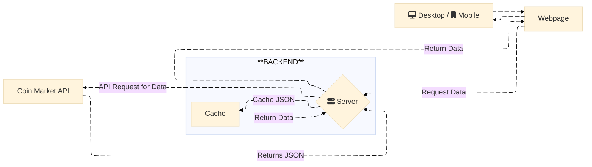

#Crypto Dashboard

```mermaid
---
config:
  theme: base
  layout: elk
---
flowchart RL
 subgraph s1["**BACKEND**"]
        D["Cache"]
        C{"fa:fa-server Server"}
  end
    A["fa:fa-desktop Desktop / fa:fa-mobile Mobile"] e1@--> B["Webpage"]
    B e2@--> A
    B e3@-- Request Data --> C
    C e4@-- Return Data --> B
    C e5@-- Cache JSON --> D
    D e6@-- Return Data --> C
    C e7@-- API Request for Data --> E["Coin Market API"]
    E e8@-- Returns JSON --> C


    e1@{ animate: true } 
    e2@{ animate: true } 
    e3@{ animate: true } 
    e4@{ animate: true } 
    e5@{ animate: true } 
    e6@{ animate: true } 
    e7@{ animate: true } 
    e8@{ animate: true }
```
